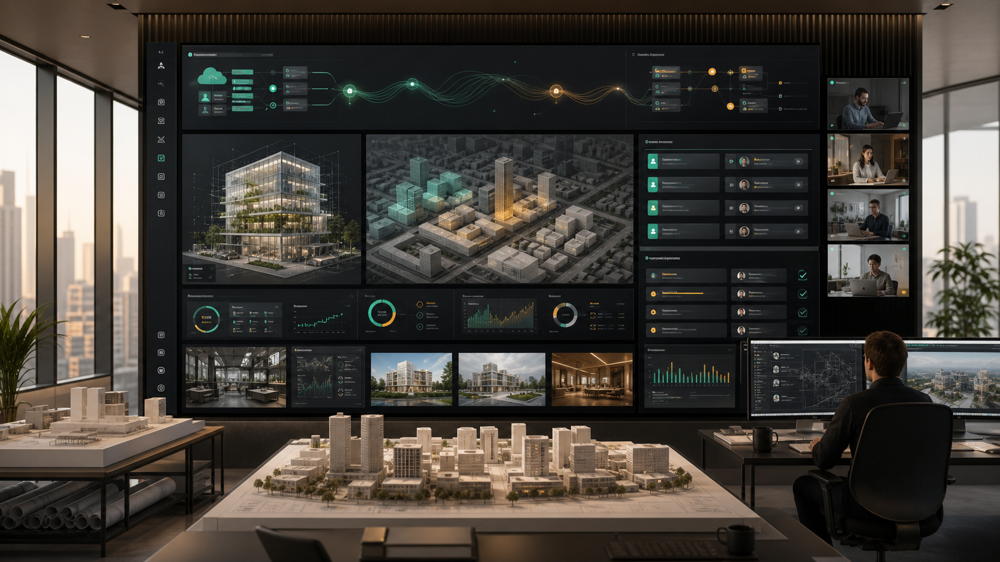
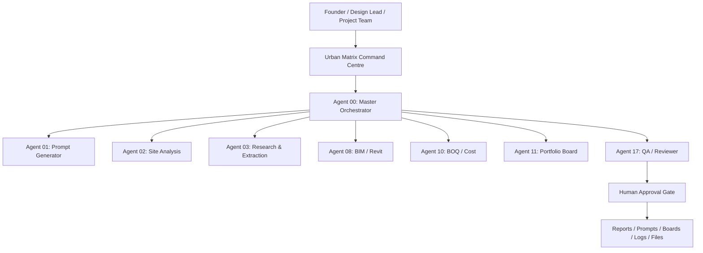
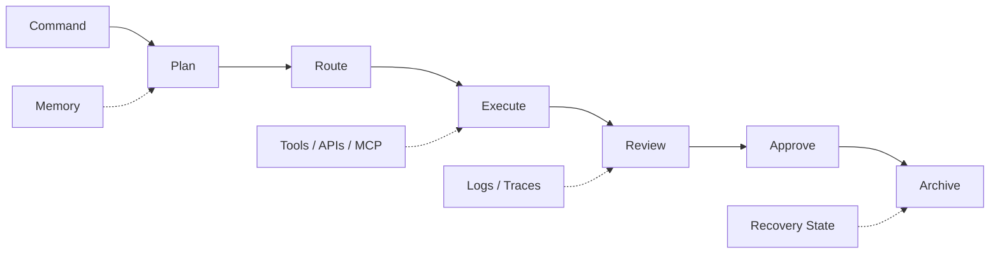
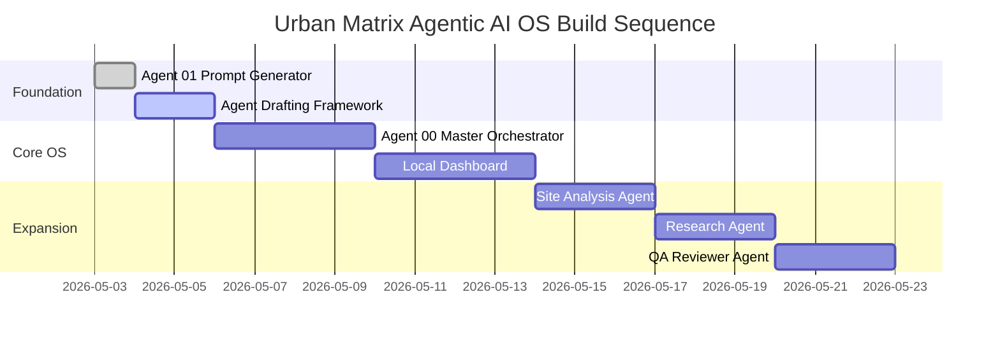

# Urban Matrix Agentic AI OS

<p align="center">
  
</p>

<p align="center">
  <strong>A cloud + local hybrid multi-agent command platform for architecture, BIM, computational design, research, visualisation, automation, and project delivery.</strong>
</p>

<p align="center">
  <a href="#english">English</a> |
  <a href="#हिन्दी">हिन्दी</a> |
  <a href="#español">Español</a> |
  <a href="#français">Français</a> |
  <a href="#العربية">العربية</a>
</p>

<p align="center">
  
  
  
  
</p>

<p align="center">
  <a href="#v01-working-build">Quick Start</a> |
  <a href="#command-centre-vision">Command Centre</a> |
  <a href="#specialist-agent-map">Agents</a> |
  <a href="#product-roadmap">Roadmap</a> |
  <a href="#safety-and-governance">Safety</a> |
  <a href="#citations">Citations</a>
</p>

## English

Urban Matrix Agentic AI OS is the foundation for a professional design operations platform: one command centre, one master orchestrator, and a controlled team of specialist AI agents for architecture, BIM, site analysis, prompt generation, research, rendering, BOQ, portfolio boards, communication, code, deployment, and QA.

The current build proves the first working pattern:

```text
Project brief -> Prompt Generator Agent -> structured JSON -> Markdown prompt package -> local output archive
```

## Product Snapshot

<table>
  <tr>
    <td><strong>Product</strong></td>
    <td>Urban Matrix Agentic AI OS</td>
  </tr>
  <tr>
    <td><strong>Dashboard Name</strong></td>
    <td>Urban Matrix Command Centre</td>
  </tr>
  <tr>
    <td><strong>Current Phase</strong></td>
    <td>v0.1 local starter with Agent 01 implemented</td>
  </tr>
  <tr>
    <td><strong>Design Domain</strong></td>
    <td>Architecture, BIM, computational design, research, AI rendering, delivery operations</td>
  </tr>
  <tr>
    <td><strong>Execution Model</strong></td>
    <td>Cloud agents for always-on tasks, local workers for Revit, Rhino, Grasshopper, ComfyUI, and private folders</td>
  </tr>
  <tr>
    <td><strong>Governance Model</strong></td>
    <td>Human approval gates, structured outputs, action logs, recoverable task state</td>
  </tr>
</table>

## Interface DNA

The GitHub front page is shaped like a product landing page, but the actual system should feel like a serious design operations cockpit: dense enough for project work, calm enough for daily use, and visually tuned for architectural decision-making.

| UI/UX Principle | Implementation Direction |
| --- | --- |
| First-screen clarity | Hero image, product definition, quick links, status badges |
| Executive scanning | Snapshot table, agent map, roadmap, safety matrix |
| Design-office realism | Project cards, approval queues, output library, local worker status |
| Trust through structure | JSON schemas, citations, logs, recovery rules, contribution standards |
| Visual rhythm | Hero image, Mermaid diagrams, compact tables, repo-native SVG system panel |
| Future motion layer | Dashboard timeline animations, agent handoff traces, task graph transitions |

<details>
<summary><strong>Visual System Notes</strong></summary>

- Charcoal command surfaces with off-white content panels.
- Teal for active agents and successful system states.
- Amber for review, queue, warning, and approval states.
- Graph lines for agent handoff, memory retrieval, and workflow routing.
- Architectural drawings, BIM previews, project boards, and model thumbnails as primary visual content.
- Avoid generic chatbot styling; the interface should feel closer to an architecture studio control room.

</details>

## Command Centre Vision

| Area | Purpose |
| --- | --- |
| Global Command Bar | Type any instruction for the Master Orchestrator |
| Active Projects | Track architecture, BIM, AI design, and delivery work |
| Agent Status | See which specialist agents are online, idle, running, or blocked |
| Approval Queue | Review risky scripts, emails, publishes, file edits, and BIM actions |
| Recent Outputs | Browse prompts, reports, boards, renders, code, and exports |
| System Health | Monitor cloud worker, local worker, API usage, queue, and logs |
| Quick Launch | Start Site Analysis, Prompt Generator, BOQ, Revit Check, Portfolio Board |

## Dashboard Component Library

| Component | Data It Shows | Design Notes |
| --- | --- | --- |
| Global Command Bar | user instruction, selected project, output type, deadline | Always visible, command-first, supports natural language and structured forms |
| Project Cards | stage, deadline, completion, active agents, latest output, approval state | Compact cards with visual progress and risk chip |
| Agent Status Rail | online, idle, running, blocked, offline | Uses color and short labels, never vague decorative indicators |
| Approval Queue | risky actions waiting for review | Clear approve/reject/edit controls with reason and audit trail |
| Task Timeline | Brief -> Research -> Site -> Concept -> Prompt -> QA -> Export | Shows handoffs, retries, blocked states, and current owner |
| Output Library | Markdown, JSON, PDFs, boards, prompts, render workflows | Filter by project, agent, date, file type, and approval state |
| System Health | cloud worker, local worker, API status, queue length | Operational panel for debugging and trust |
| Logs Console | tool calls, inputs, outputs, errors, timestamps | Developer-grade detail hidden behind expandable panels |

## Visual Reference

The generated hero image is now stored in the repository and used at the top of this README:

```text
assets/urban-matrix-command-centre-hero.png
```

The earlier vector dashboard concept remains available as a lightweight, repo-native illustration:

```text
assets/urban-matrix-hero.svg
```

## Agentic Architecture



## Operating System Layers



## Specialist Agent Map

| ID | Agent | Primary Value | Risk Level |
| --- | --- | --- | --- |
| 00 | Master Orchestrator | Routes goals, plans workflows, manages approvals | Medium |
| 01 | Prompt Generator | Creates structured architectural prompts | Low |
| 02 | Site Analysis | Extracts urban, climate, planning, and site drivers | Medium |
| 03 | Research & Extraction | Summarises URLs, PDFs, reports, and sources | Medium |
| 04 | Codes & Compliance | Supports standards and compliance research | High |
| 05 | Concept Development | Converts briefs into narratives and spatial strategies | Low |
| 06 | Visual Rendering | Builds shot lists, render prompts, camera and lighting direction | Low |
| 07 | ComfyUI Workflow | Plans workflow JSON and image-generation pipelines | Medium |
| 08 | BIM / Revit | Supports documentation, schedules, model checks, script planning | Critical |
| 09 | Rhino / Grasshopper | Plans parametric geometry and computational workflows | High |
| 10 | BOQ / Cost Planning | Produces early quantity and cost assumption structures | Medium |
| 11 | Portfolio Board | Plans A1/A2 boards, layouts, captions, and visual hierarchy | Low |
| 12 | AI Media | Creates video, storyboard, voiceover, and motion prompts | Medium |
| 13 | Communication | Drafts client updates, emails, Slack, and Telegram messages | High |
| 14 | Daily Operations | Summaries, priorities, reminders, and personal operations | Medium |
| 15 | GitHub / Code / Deployment | Repo, CI, deployment, README, and issue workflows | High |
| 16 | AI Tool Intelligence | Tracks AI tools, APIs, MCP servers, pricing, and relevance | Medium |
| 17 | QA / Reviewer | Checks schema, citations, hallucinations, missing fields, safety | Medium |

## Agent Drafting Standard

Before building each agent, Urban Matrix should create a complete agent draft. This keeps the OS controlled, testable, and safe.

| Draft Section | What It Must Define |
| --- | --- |
| Identity | agent name, definition, purpose, owner layer |
| Responsibilities | what the agent does and what it must refuse |
| Inputs | required fields, optional fields, files, URLs, project context |
| Outputs | JSON schema, Markdown format, files, dashboard state |
| Tools | APIs, MCP servers, scripts, local workers, databases |
| Memory | project memory, company style, vector knowledge, logs |
| Risk | low, medium, high, critical actions |
| Approval Gates | where human approval is mandatory |
| UI Page | controls, tabs, preview panels, logs, settings, output history |
| Tests | schema validation, failure cases, safe-action tests |
| Recovery | task restart rules, saved checkpoints, error handling |

## v0.1 Working Build

The first implemented agent is:

```text
Agent 01 — Urban Matrix Prompt Generator Agent
```

It accepts a structured project input and creates:

- JSON output
- Markdown prompt package
- negative prompt
- camera direction
- lighting direction
- consistency lock
- next-step checklist

Run it locally:

```powershell
python agents/prompt_generator_agent.py
```

Expected output:

```text
outputs/flux_pavilion_prompt_package.json
outputs/flux_pavilion_prompt_package.md
```

## Repository Structure

```text
Agentic AI System/
├── agents/
│   └── prompt_generator_agent.py
├── assets/
│   ├── urban-matrix-command-centre-hero.png
│   └── urban-matrix-hero.svg
├── docs/
│   ├── citations.md
│   ├── contributing.md
│   ├── recovery.md
│   └── system_architecture.md
├── examples/
│   └── flux_pavilion_input.json
├── outputs/
│   └── .gitkeep
├── skills/
│   └── urban_matrix_prompt_generator.md
├── tools/
│   └── markdown_writer.py
├── .env.example
├── .gitignore
├── requirements.txt
└── README.md
```

## Product Roadmap

| Phase | Build | Outcome |
| --- | --- | --- |
| 0 | Learning foundation | Run one local AI script |
| 1 | Prompt Generator Agent | Structured prompt + Markdown export |
| 2 | Local dashboard | Browser UI with form, preview, save, task history |
| 3 | Site + Research agents | Prompt + site + source-backed research workflow |
| 4 | Database + queue | Task status, logs, agent events, running/completed states |
| 5 | Cloud deployment | Dashboard and cloud agents run while laptop is off |
| 6 | Local worker | Revit, Rhino, ComfyUI, and local folder tasks run when PC is on |
| 7 | Advanced agents | BIM, ComfyUI, BOQ, Portfolio, Code, Reviewer system |

## Build Sequence



## Safety And Governance

| Risk | Example | Rule |
| --- | --- | --- |
| Low | Generate prompt, summarise note | Can run automatically |
| Medium | Write file, update Notion, create issue | Log and review when needed |
| High | Send email, publish, run script | Approval required |
| Critical | Delete files, edit Revit model, payment, production DB edit | Always approval + backup |

Core safety rules:

- Never hard-code keys.
- Never commit `.env`.
- Use read-only tokens first.
- Keep local workers behind outbound polling.
- Require approval for send, delete, publish, payment, and live BIM edits.
- Log every agent action with task ID, risk level, tool call, status, and output path.

## Persistence And Recovery

Persistence is a first-class requirement, not an afterthought.

- GitHub stores code, docs, skills, examples, and version history.
- `outputs/` stores generated packages during local development.
- Future PostgreSQL/Neon stores tasks, logs, approvals, and project records.
- Future Drive/S3/R2 stores large files, PDFs, boards, renders, and exports.
- Future vector memory can be rebuilt from approved source documents and outputs.

More detail: [docs/recovery.md](docs/recovery.md)

## Repository Front Page Strategy

This README follows proven GitHub presentation patterns:

- Strong hero visual at the top.
- Clear one-line product promise.
- Compact badges for phase, stack, safety, and mode.
- Fast navigation links.
- Scannable tables instead of long walls of text.
- Mermaid diagrams for architecture, workflow, and roadmap.
- Real output paths and quickstart commands.
- Safety, recovery, contribution, and citation sections for trust.

## Contributing

Contributions should improve the system without weakening safety. Good contribution areas include agents, skill files, dashboard UX, examples, tests, docs, and deployment workflows.

Read: [docs/contributing.md](docs/contributing.md)

## Citations

This project is based on documented patterns from OpenAI Agents, structured outputs, MCP, LangGraph, CrewAI, Autodesk Platform Services, Revit API, ComfyUI workflow JSON, and related official resources.

Full citation list: [docs/citations.md](docs/citations.md)

## Creator And Contact

<p align="center">
  
</p>

<h3 align="center">Built by PRASANNA CHAURASIA</h3>

<p align="center">
  Founder-builder behind the Urban Matrix Agentic AI OS vision: architecture, BIM, AI design systems, automation, project delivery, and creative technical workflows.
</p>

<p align="center">
  <a href="https://github.com/PrasannaChaurasia">
    
  </a>
  <a href="mailto:prasanna.subx@gmail.com">
    
  </a>
  <a href="https://github.com/PrasannaChaurasia/Agentic-AI-System">
    
  </a>
</p>

### Work With This Project

| Action | Link |
| --- | --- |
| View Creator Profile | [github.com/PrasannaChaurasia](https://github.com/PrasannaChaurasia) |
| Contact | [prasanna.subx@gmail.com](mailto:prasanna.subx@gmail.com) |
| Star This Repository | [Agentic-AI-System](https://github.com/PrasannaChaurasia/Agentic-AI-System) |
| Study The Architecture | [docs/system_architecture.md](docs/system_architecture.md) |
| Read The Recovery Plan | [docs/recovery.md](docs/recovery.md) |
| Contribute Carefully | [docs/contributing.md](docs/contributing.md) |

### Bottom CTA

If this project is useful, star the repository, follow the creator, and use the roadmap to build the Urban Matrix Command Centre one controlled agent at a time.

```text
Next build target:
Agent 00 — Master Orchestrator Agent

Before implementation:
Create the full Agent 00 professional draft, schema, workflow, permissions, dashboard page, tests, and recovery plan.
```

## हिन्दी

Urban Matrix Agentic AI OS एक hybrid cloud + local multi-agent command platform है, जो architecture, BIM, research, rendering, prompts, BOQ, portfolio boards और project delivery के लिए बनाया गया है।

## Español

Urban Matrix Agentic AI OS es una plataforma híbrida cloud + local para coordinar agentes especializados de arquitectura, BIM, investigación, visualización, costes, comunicación y entrega de proyectos.

## Français

Urban Matrix Agentic AI OS est une plateforme hybride cloud + locale pour piloter des agents spécialisés en architecture, BIM, recherche, visualisation, estimation, communication et livraison de projet.

## العربية

Urban Matrix Agentic AI OS هو نظام هجين بين السحابة والجهاز المحلي لإدارة وكلاء ذكاء اصطناعي متخصصين في العمارة وBIM والبحث والتصور والتكلفة والتسليم.
