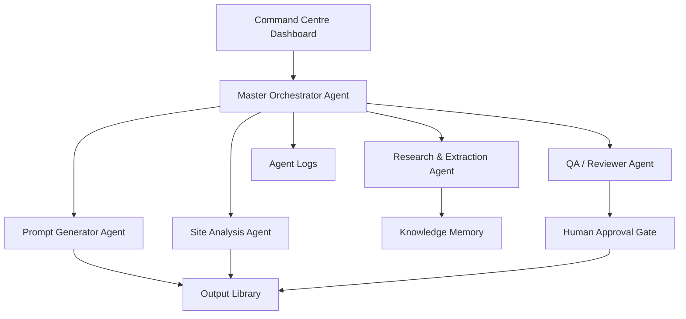

# Urban Matrix Agentic AI OS Architecture

## System Intent
Urban Matrix Agentic AI OS is designed as a hybrid cloud and local command platform for architectural design, BIM, computational design, research, rendering, communication, project delivery, and automation.

## Core Layers
- Command Centre dashboard
- Master Orchestrator Agent
- Specialist agent layer
- Tool/API/MCP layer
- Cloud and local execution workers
- Storage, memory, logs, and approval records

## v0.1 Scope
The current version proves the first repeatable pattern:

```text
Project input
-> Prompt Generator Agent
-> Structured JSON
-> Markdown package
-> Local output archive
```

## Future Architecture


